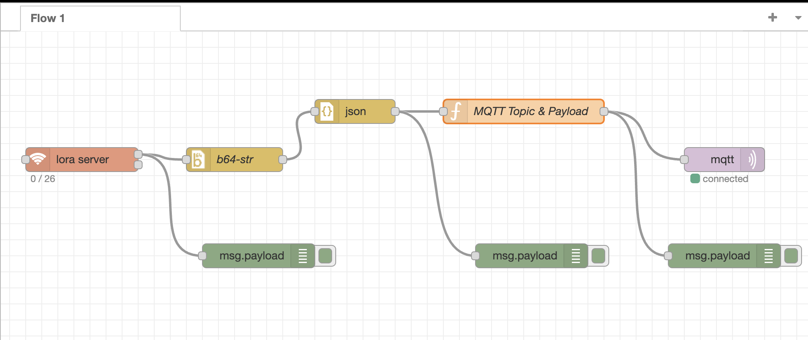

# LoRaWAN-Gateway
### LoRaWAN Gateway

WisGate Developer D0 / D0+
RAK7246 / RAK7246G

<https://store.rakwireless.com/products/rak7246-lpwan-developer-gateway?variant=36313275465886>

RAKWireless Source Code

<https://github.com/RAKWireless/rak_common_for_gateway>

#### Connect to the rak-gateway

	ssh pi@rak-gateway.local password: xxxxxx

#### Config files

[global_conf.json](./global_conf.json)   // Configures the SX1301 Concentrator and Radios 

[local_conf.json](./local_conf.json)   // Configures the gateway. Overrides the Global Config gateway config.

#### LoRa_Pkt_Fwd: Start, Stop, Restart, Status, Enable, Disable and Monitor the Service

	pi@rak-gateway:/opt/ttn-gateway/packet_forwarder/lora_pkt_fwd $ sudo systemctl status ttn-gateway.service 
	● ttn-gateway.service - The Things Network Gateway
	   Loaded: loaded (/lib/systemd/system/ttn-gateway.service; enabled; vendor preset: enabled)
	   Active: active (running) since Sat 2022-06-18 11:17:20 EDT; 55min ago
 	Main PID: 311 (start.sh)
	    Tasks: 6 (limit: 877)
	   CGroup: /system.slice/ttn-gateway.service
 	          ├─311 /bin/bash /opt/ttn-gateway/packet_forwarder/lora_pkt_fwd/start.sh
	           └─368 ./lora_pkt_fwd

	Jun 18 12:11:13 rak-gateway ttn-gateway[311]: src/jitqueue.c:448:jit_print_queue(): INFO: [jit] queue is empty
	Jun 18 12:11:13 rak-gateway ttn-gateway[311]: ### [GPS] ###
	Jun 18 12:11:13 rak-gateway ttn-gateway[311]: # GPS sync is disabled
	Jun 18 12:11:13 rak-gateway ttn-gateway[311]: ##### END #####
	Jun 18 12:11:13 rak-gateway ttn-gateway[311]: JSON up: {"stat":{"time":"2022-06-18 16:10:43 GMT","rxnb":0,"rxok":0,"rxfw":0,"ackr":100.
	Jun 18 12:11:13 rak-gateway ttn-gateway[311]: INFO: [up] PUSH_ACK received in 0 ms
	Jun 18 12:11:13 rak-gateway ttn-gateway[311]: INFO: [down] PULL_ACK received in 0 ms
	Jun 18 12:11:13 rak-gateway ttn-gateway[311]: ##### 2022-06-18 16:11:13 GMT #####
	Jun 18 12:11:13 rak-gateway ttn-gateway[311]: ### [UPSTREAM] ###
	Jun 18 12:11:13 rak-gateway ttn-gateway[311]: # RF packets received by concentrator: 0
	pi@rak-gateway:/opt/ttn-gateway/packet_forwarder/lora_pkt_fwd $
	
	pi@rak-gateway:/opt/ttn-gateway/packet_forwarder/lora_pkt_fwd $ sudo systemctl stop ttn-gateway.service
	
	pi@rak-gateway:/opt/ttn-gateway/packet_forwarder/lora_pkt_fwd $ sudo systemctl start ttn-gateway.service

	pi@rak-gateway:/opt/ttn-gateway/packet_forwarder/lora_pkt_fwd $ sudo systemctl restart ttn-gateway.service

	pi@rak-gateway:/opt/ttn-gateway/packet_forwarder/lora_pkt_fwd $ sudo systemctl enable ttn-gateway.service

	pi@rak-gateway:/opt/ttn-gateway/packet_forwarder/lora_pkt_fwd $ sudo systemctl disable ttn-gateway.service

	pi@rak-gateway:/opt/ttn-gateway/packet_forwarder/lora_pkt_fwd $ journalctl -u ttn-gateway.service -f

	

### Node-Red

#### Connect to node-red

	http://rak-gateway.local:1880

#### Config

[Flow Configuration](./flows.json)

#### Nodered: Start, Stop, Restart, Status, Enable, Disable and Monitor the service

	pi@rak-gateway:/opt/ttn-gateway/packet_forwarder/lora_pkt_fwd $ sudo systemctl status nodered.service 
	● nodered.service - Node-RED graphical event wiring tool
	   Loaded: loaded (/lib/systemd/system/nodered.service; enabled; vendor preset: enabled)
	   Active: active (running) since Sat 2022-06-18 11:17:19 EDT; 55min ago
	     Docs: http://nodered.org/docs/hardware/raspberrypi.html
	 Main PID: 281 (node-red)
	    Tasks: 11 (limit: 877)
	   CGroup: /system.slice/nodered.service
	           └─281 node-red

	Jun 18 11:18:11 rak-gateway Node-RED[281]: If the system-generated key is lost for any reason, your credentials
	Jun 18 11:18:11 rak-gateway Node-RED[281]: file will not be recoverable, you will have to delete it and re-enter
	Jun 18 11:18:11 rak-gateway Node-RED[281]: your credentials.
	Jun 18 11:18:11 rak-gateway Node-RED[281]: You should set your own key using the 'credentialSecret' option in
	Jun 18 11:18:11 rak-gateway Node-RED[281]: your settings file. Node-RED will then re-encrypt your credentials
	Jun 18 11:18:11 rak-gateway Node-RED[281]: file using your chosen key the next time you deploy a change.
	Jun 18 11:18:11 rak-gateway Node-RED[281]: ---------------------------------------------------------------------
	Jun 18 11:18:11 rak-gateway Node-RED[281]: 18 Jun 11:18:11 - [info] Starting flows
	Jun 18 11:18:13 rak-gateway Node-RED[281]: 18 Jun 11:18:13 - [info] Started flows
	Jun 18 11:18:13 rak-gateway Node-RED[281]: 18 Jun 11:18:13 - [info] [mqtt-broker:RaspberryPi] Connected to broker: mqtt://192.168.8.174

	 pi@rak-gateway:/opt/ttn-gateway/packet_forwarder/lora_pkt_fwd $ sudo systemctl start nodered.service

	 pi@rak-gateway:/opt/ttn-gateway/packet_forwarder/lora_pkt_fwd $ sudo systemctl stop nodered.service

	 pi@rak-gateway:/opt/ttn-gateway/packet_forwarder/lora_pkt_fwd $ sudo systemctl restart nodered.service

	 pi@rak-gateway:/opt/ttn-gateway/packet_forwarder/lora_pkt_fwd $ sudo systemctl enable nodered.service

	 pi@rak-gateway:/opt/ttn-gateway/packet_forwarder/lora_pkt_fwd $ sudo systemctl disable nodered.service

	pi@rak-gateway:/opt/ttn-gateway/packet_forwarder/lora_pkt_fwd $ journalctl -u nodered.service -f

### Verify MQTT publish

	pi@rak-gateway:/opt/ttn-gateway/packet_forwarder/lora_pkt_fwd $ mosquitto_sub -t /sensors/field/# -u xxxxxx -P xxxxxx -h 192.168.8.174

	{"NID":"010349","INDEX":0,"HUM":50.95,"TEMP":81.44,"MOIST":887,"BAT":953,"TMST":782566940}

