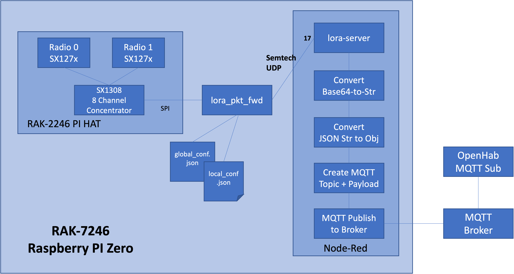

# UrbanFarmsIOT
IOT Projects

### LoRaWAN Gateway

WisGate Developer D0 / D0+
RAK7246 / RAK7246G

<https://store.rakwireless.com/products/rak7246-lpwan-developer-gateway?variant=36313275465886>

RAKWireless Source Code

<https://github.com/RAKWireless/rak_common_for_gateway>

### Makerfabs LoRa Soil Moisture Sensor

#### Website

<https://www.makerfabs.com/lora-soil-moisture-sensor-v3.html>

#### Wiki

<https://www.makerfabs.com/wiki/index.php?title=Lora_Soil_Moisture_Sensor_V3>

#### Github

<https://github.com/Makerfabs/Lora-Soil-Moisture-Sensor/tree/master/V3>

### US Frequency Plan
#### US902-928 Sub-Band 2

        Uplink:

        903.9 - SF7BW125 to SF10BW125
        904.1 - SF7BW125 to SF10BW125
        904.3 - SF7BW125 to SF10BW125
        904.5 - SF7BW125 to SF10BW125
        904.7 - SF7BW125 to SF10BW125
        904.9 - SF7BW125 to SF10BW125
        905.1 - SF7BW125 to SF10BW125
        905.3 - SF7BW125 to SF10BW125
        904.6 - SF8BW500

        Downlink:

        923.3 - SF7BW500 to SF12BW500 (RX1)
        923.9 - SF7BW500 to SF12BW500 (RX1)
        924.5 - SF7BW500 to SF12BW500 (RX1)
        925.1 - SF7BW500 to SF12BW500 (RX1)
        925.7 - SF7BW500 to SF12BW500 (RX1)
        926.3 - SF7BW500 to SF12BW500 (RX1)
        926.9 - SF7BW500 to SF12BW500 (RX1)
        927.5 - SF7BW500 to SF12BW500 (RX1)
        923.3 - SF12BW500 (RX2)
